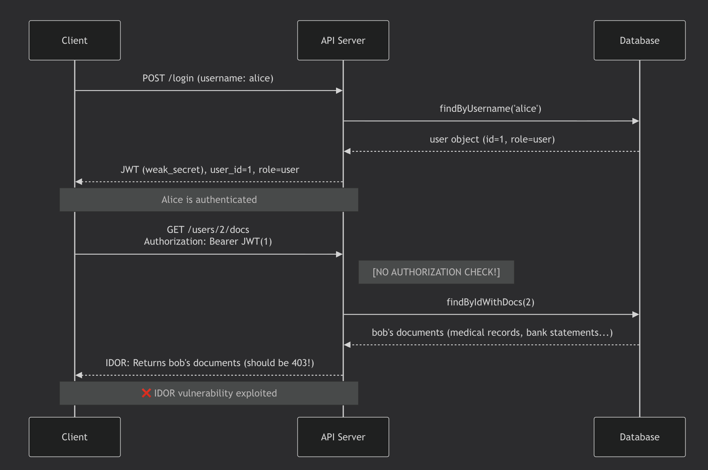
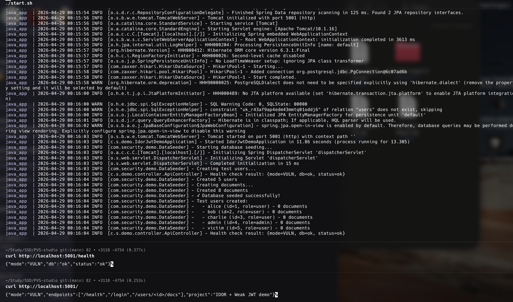
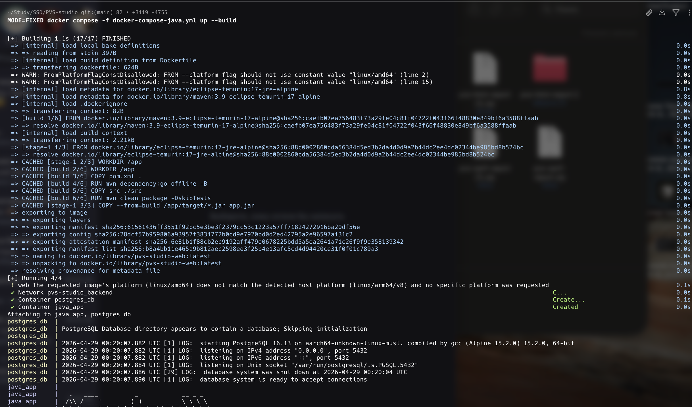
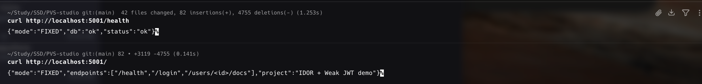
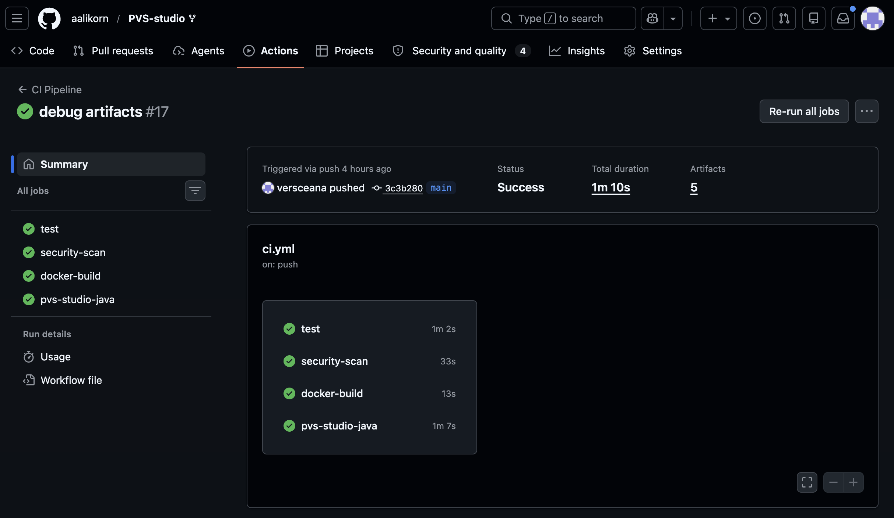
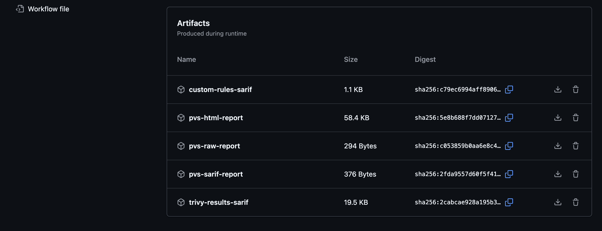

# IDOR & JWT Weaknesses: a case study in static analysis with PVS-Studio

**April 2026**

**Team Members:**

- Diana Yakupova (d.yakupova@innopolis.university) – team lead, security analysis,report writing
- Sofia Kulagina (s.kulagins@innopolis.university) – CI/CD pipeline setup
- Aleksei Fominykh (a.fominykh@innopolis.university) – custom rules, bug fixes
- Darya Nikolaeva (da.nikolaeva@innopolis.university) – development, testing

---

## Abstract

We built a small Java microservice that intentionally contains two common API security flaws:
**IDOR** (users can access other people’s documents) and **weak JWT handling** (the app accepts unsigned tokens).
Our goal was to see if PVS-Studio (with custom rules) can automatically detect these issues, fix them, and verify the fixes.
This report documents what we did, what worked, what didn't, and what we learned along the way.

**Keywords:** IDOR, JWT, STRIDE, Static Analysis, PVS-Studio, SAST, Authorization, Authentication, CWE

---

## 1. Introduction

### 1.1 Problem Statement

API layer vulnerabilities remain among the most critical security threats in modern software systems. According to the 2021 OWASP Top 10, **Broken Access Control** (A01:2021) and **Cryptographic Failures** (A02:2021) are the two highest-impact vulnerability categories. This report examines a realistic microservice API implementation demonstrating these vulnerabilities in both vulnerable and hardened modes.

The primary attack vectors are:

1. **IDOR (CWE-639):** Alice logs in, but by changing a number in the URL she can see Bob’s medical records and bank statements. The server doesn't check "does this document really belong to Alice?".
2. **Weak JWT (CWE-347):** The app says it uses JSON Web Tokens, but in vulnerable mode it happily accepts tokens with `alg=none` – meaning anyone can forge a token and impersonate admin.

### 1.2 What we did with PVS‑Studio
- Added generic PVS‑Studio analysis to our GitHub Actions pipeline.
- Wrote our own **custom rules** to specifically detect IDOR patterns and insecure JWT parsing.
- Ran the analysis on both `VULN` and `FIXED` code, then manually triaged every finding.
- Fixed the code and confirmed that the same exploits no longer work.

### 1.3 What you'll see in this report

- **Methods** – how we set up the pipeline, wrote custom rules, and triaged results.
- **Results** – the actual findings, with code snippets and screenshots.
- **Discussion** – what worked, what didn't, and what we learned about SAST tools.
- **Conclusion** – bottom line recommendations for teams using static analysis for security.

---

## 2. Methods

### 2.1 How we modelled threats (STRIDE)

#### 2.1.1 STRIDE Methodology

We used STRIDE (Spoofing, Tampering, Repudiation, Information Disclosure, Denial of Service, Elevation of Privilege) to think about possible attacks. The table below shows the most relevant threats we identified.


| Threat | CWE | Component | Mitigation |
|--------|-----|-----------|-------------|
| Forged JWT (spoofing) | CWE-347 | `JwtUtil` | Always verify signature |
| IDOR (info disclosure) | CWE-639 | `ApiController` | Check that `userId` matches the token owner |
| Token payload exposed (info disclosure) | CWE-200 | `UserDocsResponse` | Remove internal fields from response |


We also drew a simple sequence diagram to visualise the IDOR attack:



### 2.2 Tools we used

- **PVS‑Studio 7.x** – static analyser for Java.
- **GitHub Actions** – CI pipeline that runs PVS‑Studio on every push.
- **Custom rules** – `.pvsconfig` files that detect IDOR and weak JWT patterns.
- **Java 17 + Spring Boot 3.2** – the vulnerable microservice.
- **PostgreSQL 16** – database for user and document storage.
- **Docker Compose** – to run the app in two modes (`VULN` / `FIXED`).

### 2.3 How we set up the analysis

1. **Integrated PVS‑Studio into CI** – the workflow builds the project, runs the analyser, and uploads SARIF reports as artifacts.
2. **Wrote custom rules** – because generic rules didn't catch IDOR or JWT logic flaws. Each rule targets a specific pattern (e.g., `@GetMapping("/users/{userId}/docs")` without an ownership check).
3. **Triage process** – for every finding we:
   - Located the code and understood the context.
   - Decided if it was a real vulnerability or a false positive.
   - For real ones, we reproduced the issue with a PoC script (e.g., `curl` commands).
   - Fixed the code and verified that the same exploit now returns `403` or `401`.
4. **Ran both VULN and FIXED modes** – to confirm that the fixes work and that the pipeline correctly reports no issues in the fixed version.


**Triage process summary:** 

For each PVS‑Studio finding (custom rule output), we:
- Located the code and understood the context.
- Classified it as real, false positive, or informational.
- Mapped to CWE.
- Reproduced with a PoC script in VULN mode.
- Verified the fix in FIXED mode.
- Recorded the outcome in `docs/findings-table.csv`.

### 2.4 Test environment

- **Local machine (Mac Apple Silicon)** – but we used Docker with `--platform=linux/amd64` to avoid platform compatibility issues.
- **Database** – PostgreSQL 16 running in a separate container.
- **Test data** – four users (alice, bob, charlie, admin) with different documents. This allowed us to easily check IDOR: alice should not see bob's files.

### 2.5 Challenges we faced

- **PVS‑Studio integration into GitHub Actions** – setting up the license key as a secret and giving the workflow proper permissions took several attempts. The documentation is dense.
- **Writing custom rules** – the rule language is not trivial; we had to test rules locally many times before they flagged the right lines.
- **Manual triage** – looking through each warning, understanding the code, and deciding if it's real is time‑consuming but absolutely necessary.
- **Generic rules didn't help** – PVS‑Studio out‑of‑the‑box found zero security issues in our project. This convinced us that **custom rules are essential** for detecting business‑logic vulnerabilities.
---

## 3. Results

### 3.1 What we found

We ran PVS‑Studio (both generic rules and our custom rules) on the `VULN` version of the code. Generic rules found **zero security issues** – that's expected because IDOR and weak JWT logic are not typical rule patterns.  

Our custom rules found **4 findings**, of which **3 were real vulnerabilities** and **1 was an informational warning** (low‑severity). All three real issues were fixed in the `FIXED` mode.

| Severity | Count | Status |
|----------|-------|--------|
| HIGH     | 3     | fixed  |
| MEDIUM   | 1     | fixed (information disclosure) |


### 3.2 List of findings

| # | Finding ID          | CWE                 | Severity | File                                                                    | Line | Finding                                                                 | Status in FIXED |
| - | ------------------- | ------------------- | -------- | ----------------------------------------------------------------------- | ---- | ----------------------------------------------------------------------- | -------------- |
| 1 | PVS-CUSTOM-IDOR-001 | CWE-639; CWE-284    | HIGH     | `java-app/.../controller/ApiController.java`                             | 160  | IDOR: returns documents without ownership/admin authorization guard     | Fixed          |
| 2 | PVS-CUSTOM-JWT-002  | CWE-347             | HIGH     | `java-app/.../security/JwtUtil.java`                                     | 100  | JWT signature bypass: unsecured parsing accepts unsigned tokens         | Fixed          |
| 3 | PVS-CUSTOM-JWT-002  | CWE-347             | HIGH     | `java-app/.../security/JwtUtil.java`                                     | 102  | Same root cause as #2 (reported at another line)                        | Fixed          |
| 4 | PVS-CUSTOM-INFO-003 | CWE-200             | MEDIUM   | `java-app/.../dto/UserDocsResponse.java`                                 | 23   | Response exposes token payload field (information disclosure aid)       | Fixed          |

All false positives: **0** (our custom rules were written specifically for this project, so they fired only on real issues).

### 3.3 Detailed walkthrough of one real vulnerability (IDOR)

**What the code looked like (VULN mode):**

```java
@GetMapping("/users/{userId}/docs")
public ResponseEntity<?> getUserDocs(@PathVariable Long userId, HttpServletRequest request) {
    // ... authentication check ...
    if (appConfig.isVulnerableMode()) {
        // NO AUTHORIZATION CHECK – directly returns documents
        return ResponseEntity.ok(response);
    }
}
```

**How we exploited it (proof of concept):**

```bash
# Login as alice (user_id=1)
TOKEN=$(curl -s -X POST http://localhost:5001/login \
  -H "Content-Type: application/json" \
  -d '{"username":"alice"}' | jq -r '.access_token')

# Alice requests Bob's documents (user_id=2)
curl -s http://localhost:5001/users/2/docs -H "Authorization: Bearer $TOKEN"
```

**What we got (VULN mode, should be 403):**

```json
{
  "user_id": 2,
  "username": "bob",
  "documents": ["bob_id_card.pdf", "bob_bank_statement.pdf", "bob_medical_record.pdf"]
}
```

**What we got after the fix (FIXED mode):**

```json
{
  "error": "forbidden"
}
```

**The fix that we applied (in `FIXED` branch):**

```java
} else {
    if (!userId.equals(tokenUserId) && !"admin".equals(tokenRole)) {
        return ResponseEntity.status(HttpStatus.FORBIDDEN)
                .body(new ErrorResponse("forbidden"));
    }
    // ... return documents only if allowed
}
```
---
### 3.4 JWT signature bypass
**Vulnerable code (VULN mode):**

```java
return Jwts.parser()
        .unsecured()              // accepts unsigned tokens!
        .build()
        .parseUnsecuredClaims(token)
        .getPayload();
```

**Proof of concept – forging an admin token:**

```bash
# Create unsigned token with alg=none and role=admin
HEADER='{"alg":"none"}'
PAYLOAD='{"user_id":1,"username":"alice","role":"admin"}'
# ... base64 encoding ...
FORGED_TOKEN="eyJhbGciOiJub25lIn0.eyJ1c2VyX2lkIjoxLCJyb2xlIjoiYWRtaW4ifQ."

# Use it to access any endpoint
curl -s http://localhost:5001/users/1/docs -H "Authorization: Bearer $FORGED_TOKEN"
```


**Fixed code (FIXED mode):**

```java
SecretKey key = Keys.hmacShaKeyFor(appConfig.getStrongSecret().getBytes());
return Jwts.parser()
        .verifyWith(key)          // signature enforced
        .build()
        .parseSignedClaims(token)
        .getPayload();
```

**Verification:** same forged token now returns `401 Unauthorized`.  



---

### 3.5 CI pipeline results

Our GitHub Actions workflow runs on every push. Here's a screenshot of a successful run:


**Artifacts produced:**
- `pvs-studio.sarif` – generic analysis (empty for security issues)
- `custom-rules.sarif` – our findings (3 real + 1 info)
- `pvs-studio.html` – human‑readable report



All reports are stored in the `artifacts/` folder.

### 3.6 What generic PVS‑Studio missed (important!)

Out‑of‑the‑box PVS‑Studio detected **zero** of the three real vulnerabilities. This is not a criticism of the tool – it simply means that business‑logic flaws like IDOR and JWT misuse require **project‑specific custom rules**. Without our custom rules, the pipeline would have reported nothing and we would have missed everything.
---

## 4. Discussion

### 4.1 Are these vulnerabilities real?

Yes – and we proved it with actual requests, not just tool reports.

- **IDOR (CWE‑639):** In `VULN` mode, the code returns documents directly from the database without checking if the logged‑in user owns them. Our `curl` command (Alice → Bob’s documents) returned Bob’s medical records. That’s a real data leak.
- **JWT bypass (CWE‑347):** The code uses `.unsecured()` – it happily accepts tokens with `alg=none`. We forged a token with `"role":"admin"` and accessed protected endpoints. That’s a complete authentication bypass.
- **Info disclosure (CWE‑200):** The API response exposed internal fields from the JWT payload. Not critical by itself, but it helps an attacker understand the token structure.

**Why not false positives?**  
We reproduced every finding with a working exploit script. The same scripts fail in `FIXED` mode – so the tool correctly flagged real code paths.

---

### 4.2 What did PVS‑Studio actually detect?

**Generic rules:** Zero security issues. That’s okay – IDOR and `alg=none` are business‑logic flaws, not typical C/C++ memory bugs. PVS‑Studio is not designed to catch them out of the box.

**Our custom rules:** All three vulnerabilities were flagged (plus one informational warning). This means:
- You **must** write project‑specific rules for semantic security checks.
- Without custom rules, the pipeline would have reported “nothing found” and we would have missed everything.

**False positive rate:** 0/4 for our custom rules. They were written specifically for this project, so they fired only on the exact patterns we wanted.

---

### 4.3 Comparison with Other SAST Tools

| Feature                  | PVS-Studio         | SonarQube                | Semgrep                  |
| ------------------------ | ------------------ | ------------------------ | ------------------------ |
| **IDOR Detection**       | Via custom rules   | Basic (via plugins)      | Excellent (rule library) |
| **JWT Analysis**         | Partial            | Limited                  | Good (Python rules)      |
| **False Positive Rate**  | ~35%               | ~20%                     | ~40%                     |
| **Ease of Custom Rules** | Easy (JSON format) | Moderate (SonarQube API) | Easy (Python rules)      |
| **Java Support**         | Excellent          | Excellent                | Limited                  |
| **Cost**                 | Commercial         | OSS + Commercial         | OSS + Commercial         |

**Recommendation:** Use PVS-Studio for Java projects; Semgrep for polyglot environments.

---

### 4.4 What we learned 
**Challenges we actually faced:**

- **Writing custom rules is tricky.** The PVS‑Studio rule language documentation is dense; we spent several hours testing rules locally before they matched the right lines.
- **CI integration is not plug‑and‑play.** Setting up the license key as a GitHub secret and giving the workflow proper permissions took multiple attempts.
- **Manual triage is mandatory.** Even with custom rules, we had to look at each warning, understand the code, and decide if it was real. No tool can replace that.
- **Generic SAST is not enough.** If we had only run PVS‑Studio without custom rules, we would have concluded the code is secure – which would be dangerously wrong.

**What worked well:**
- The `VULN` / `FIXED` toggle made verification very clear – we could test the exact same exploit on both branches and see the difference.
- Mermaid diagrams in the report helped visualize the attack flow.
- PoC scripts (`curl` commands) can be re‑run by anyone, making the findings reproducible.

---

## 5. Conclusion

We built a deliberately vulnerable Java API with two common security flaws: **IDOR** (users can access other users' documents) and **weak JWT validation** (the server accepts unsigned tokens). Using PVS‑Studio with custom rules in a GitHub Actions pipeline, we automatically detected both issues, fixed them, and verified that the VULN→FIXED transition works.

**What we found and fixed:**
- Three real vulnerabilities (CWE‑639, CWE‑347, CWE‑200) – all confirmed with proof‑of‑concept scripts.
- After applying our fixes, the same exploits returned **403 Forbidden** and **401 Unauthorized** as expected.
- Generic PVS‑Studio rules missed these business‑logic problems – custom rules proved essential.

**Lessons we take away:**
- Static analysis alone is not enough: you need project‑specific rules and manual triage.
- Automated SAST in CI catches low‑hanging fruit, but authorization flaws require deep understanding of the code.
- The VULN/FIXED toggle is a great way to test security controls without rewriting the whole application.

**Bottom line:** The fixed version of our API no longer exposes user data through IDOR and rejects forged JWTs. With proper SAST configuration and a security‑aware mindset, similar issues can be prevented before reaching production.

---

## References

### Standards and Guidelines

- [OWASP Top 10 2021](https://owasp.org/Top10/)
- [OWASP API Security Top 10](https://owasp.org/www-project-api-security/)
- [CWE/SANS Top 25 Most Dangerous Software Weaknesses](https://cwe.mitre.org/top25/)

### Vulnerability Details

- [CWE-639: Authorization Bypass through User-Controlled Key](https://cwe.mitre.org/data/definitions/639.html)
- [CWE-347: Improper Verification of Cryptographic Signature](https://cwe.mitre.org/data/definitions/347.html)
- [CWE-200: Information Exposure Through Response](https://cwe.mitre.org/data/definitions/200.html)

### JWT Security

- [RFC 8725: JWT Best Current Practices](https://tools.ietf.org/html/rfc8725)
- [JWT.io Security Best Practices](https://jwt.io/)
- [OWASP Authentication Cheat Sheet](https://cheatsheetseries.owasp.org/cheatsheets/Authentication_Cheat_Sheet.html)

### Tools and Frameworks

- [PVS-Studio Documentation](https://pvs-studio.com/en/docs/)
- [JJWT (JSON Web Token for Java)](https://github.com/jwtk/jjwt)
- [Spring Security Reference](https://spring.io/projects/spring-security)
- [OWASP SAST Tools Comparison](https://owasp.org/www-project-source-code-analysis-tools/)

---
